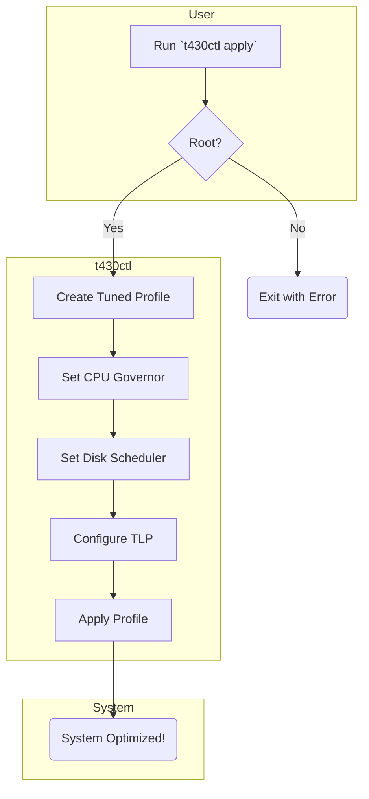

[README.md](https://github.com/user-attachments/files/26125747/README.md)
# t430ctl - ThinkPad T430 Optimization Tool for Linux


`t430ctl` is a command-line utility written in Rust to apply a set of performance and power-saving tweaks for a Lenovo ThinkPad T430 running a Red Hat-based Linux distribution (like RHEL, Fedora, or CentOS). It automates the process of configuring `tuned`, `TLP`, and various system parameters for an optimal balanced-development experience.

## How It Works

The tool is designed to be simple and safe. It creates a custom `tuned` profile and modifies system settings in a way that can be easily reverted.



## Features

*   **CPU Governor:** Sets the `schedutil` governor for a good balance between performance and power saving.
*   **Custom `tuned` Profile:** Creates a `t430-balanced-dev` profile that includes:
    *   Optimal `sysctl` settings for `vm.swappiness`, `vfs_cache_pressure`, and dirty page ratios.
    *   Disabling transparent hugepages to prevent potential latency spikes.
    *   Setting the disk I/O scheduler to `mq-deadline`.
*   **TLP Integration:**
    *   Disables USB autosuspend to prevent issues with peripherals.
    *   Ensures TLP uses the `schedutil` governor.
*   **Idempotent & Reversible:** You can run `apply` multiple times, and a `revert` command is available to undo all changes.
*   **Robustness:** Checks for required commands (like `tlp`) and root privileges before making changes.

## Prerequisites

Before using `t430ctl`, ensure the following components are installed on your system.

On RHEL/Fedora:
```bash
sudo dnf install tuned tlp tlp-rdw lm_sensors cpupower
```

You also need the Rust toolchain (compiler `rustc` and build tool `cargo`) to build the project.

## Installation & Usage

1.  **Clone the Repository**

    ```bash
    git clone https://github.com/<YOUR_USERNAME>/t430ctl.git
    cd t430ctl
    ```

2.  **Build the Project**

    You can build a debug version for testing or a release version for production use.

    ```bash
    # For a debug build
    cargo build

    # For an optimized release build
    cargo build --release
    ```
    The executable will be located at `target/debug/t430ctl` or `target/release/t430ctl`.

3.  **Run the Tool**

    The tool provides three main commands: `apply`, `revert`, and `diag`.

    *   **`apply`**: Applies all optimizations. **Requires root privileges.**

        ```bash
        # Use the appropriate path for debug/release
        sudo ./target/debug/t430ctl apply
        ```

    *   **`diag`**: Runs a set of diagnostic commands to check the current system state (CPU temps, tuned profile, etc.). Does not require root.

        ```bash
        ./target/debug/t430ctl diag
        ```

    *   **`revert`**: Reverts all changes made by the `apply` command, restoring the system to its previous state. **Requires root privileges.**

        ```bash
        sudo ./target/debug/t430ctl revert
        ```

4.  **(Optional) Install System-Wide**

    For easier access, you can copy the release binary to a directory in your `PATH`.

    ```bash
    sudo cp target/release/t430ctl /usr/local/bin/
    
    # Now you can run it from anywhere
    sudo t430ctl apply
    ```

## Configuration Details

The `apply` command performs the following actions:

| Category      | Setting                 | Value                   | Rationale                                           |
|---------------|-------------------------|-------------------------|-----------------------------------------------------|
| **CPU**       | Governor                | `schedutil`             | Modern, balanced governor for performance/power.    |
| **Disk I/O**  | Scheduler (HDD)         | `mq-deadline`           | Good for responsiveness on rotational disks.        |
|               | Readahead               | `512` KB                | A reasonable default for mixed workloads.           |
| **Memory**    | `vm.swappiness`         | `10`                    | Reduces the tendency to swap to the slow HDD.       |
|               | `vm.vfs_cache_pressure` | `50`                    | Encourages keeping filesystem metadata in RAM.      |
|               | `transparent_hugepages` | `never`                 | Avoids latency issues with some applications.       |
| **Power**     | `USB_AUTOSUSPEND`       | `0` (Off)               | Prevents mice/keyboards from disconnecting.         |


## Contributing

Contributions are welcome! If you have suggestions for improvements or new tweaks, feel free to open an issue or submit a pull request.

1.  Fork the repository.
2.  Create a new branch (`git checkout -b feature/my-new-feature`).
3.  Make your changes.
4.  Commit your changes (`git commit -am 'Add some feature'`).
5.  Push to the branch (`git push origin feature/my-new-feature`).
6.  Create a new Pull Request.

## License

This project is licensed under the MIT License - see the LICENSE.md file for details.

---
*This tool is provided as-is. Always back up important data before making system-level changes.*
